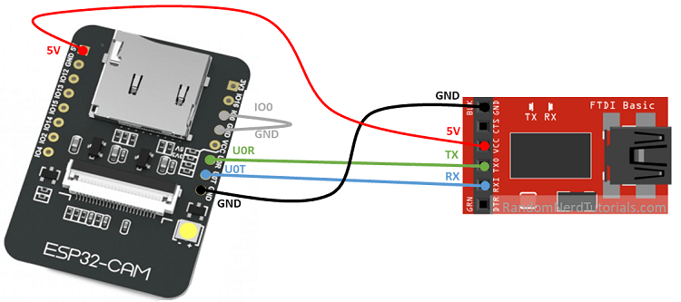

# MoodCap
This repository contains code for the MoodCap project. A MoodCap is a baseball
cap that has a micro camera attached to it. This micro camera captures the face
of the person wearing the cap. These pictures can be used to analyze the mood
of a person. The main reason for designing MoodCap is to analyze the facial
expressions of sports athletes to monitor their fitness and condition.

The most important requirement of MoodCap is to acquire pictures of the face
in an easy way without hindering the athlete. MoodCap should be userfriendly
and easy to use for all athletes.

__folder structure:__
- `backend`: __outdated__ - contains a .NET framework that handles HTTP
requests.
- `esp32`: Arduino code for the esp32 camera.
- `functions`: The Google cloud functions that process the incoming HTTP
requests.

## ESP32
The esp32 is a simple circuit board that can be programmed similarly to an
Arduino. For this project an ESP32 board is used that can connect to a micro
camera. The pictures taken by the micro camera are transmitted via HTTP POST
requests to the backend for storage.

### Requirements
The following requirements must be met in order to upload code to your eps32.
1. Install [Arduino IDE](https://www.arduino.cc/en/software)
2. Add an additional board manager via __file > preferences__

Then add _https://dl.espressif.com/dl/package_esp32_index.json_.

3. Therafter install the esp32 board manager via __tools > board >__
__boards manager__

search for __ESP32__ and install the ESP32 plugin by _EspressifSystems_.

4. Select the correct board in Arduino IDE via __tools > board__. Select
__AI Thinker ESP32-CAM__.

After performing these steps you the Arduino IDE can be used to compile and
upload the `.ino` files in the `esp32` folder to your esp32 camera.

### Code the ESP32 camera
In order to upload code to your ESP32 camera you need an
[FTDI programmer](https://makeradvisor.com/tools/ftdi-programmer-board/).
The ESP32 should be connected to the FTDI programmer as follows:

## functions
The MoodCap project uses Google Cloud for handling the image requests. Google
Cloud Functions are used to handle incoming requests. The images uploaded via
these functions store the image on Google Cloud Storage.

_if you want to use this code you must create your own Google Cloud account_
_and deploy the functions to that account. Read the Google Cloud Documentation._
__Do not forget to create your own bucket in Google Cloud Storage. In the__
__PostImage function a bucket named moodcap is used. You can either use the__
__same name for your bucket or change the name there.__

 
## backend
__outdated - because the esp32 cannot resolve local IP addresses__
This folder contains a .NET framework for a REST API. One of the endpoints is
able to save an image that is send via a POST request.
